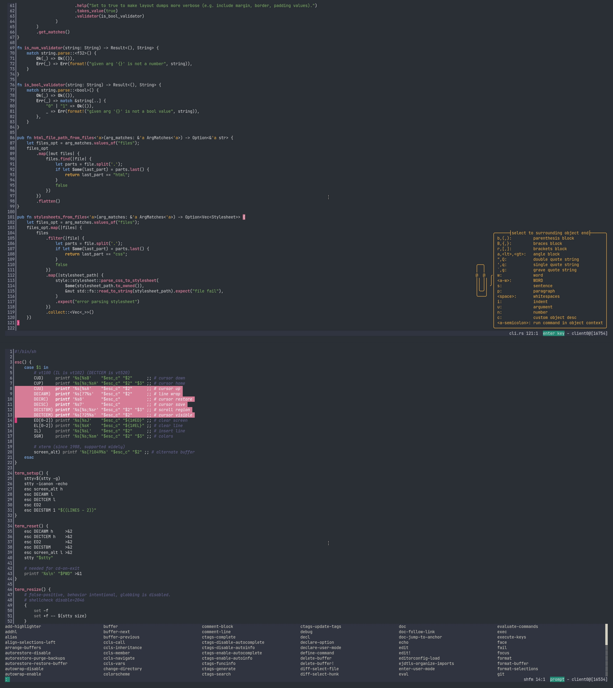

## Ladies Night Kakoune Theme

Based on [Ladies Night 2](http://color-themes.com/?view=theme&id=566065a4ddacef1b003edb63)

# Install

1.	git clone https://github.com/tagirov/kakoune-ladies-night-theme
2.	mkdir -p ~/.config/kak/colors/ && mv ./kakoune-ladies-night-theme/ladies-night.kak ~/.config/kak/colors/
3.	Run Kakoune and type: **:colorscheme ladies-night**
4.  For set this theme as default, add following to your kakrc: **echo "colorscheme ladies-night" >> ~/.config/kak/kakrc**

